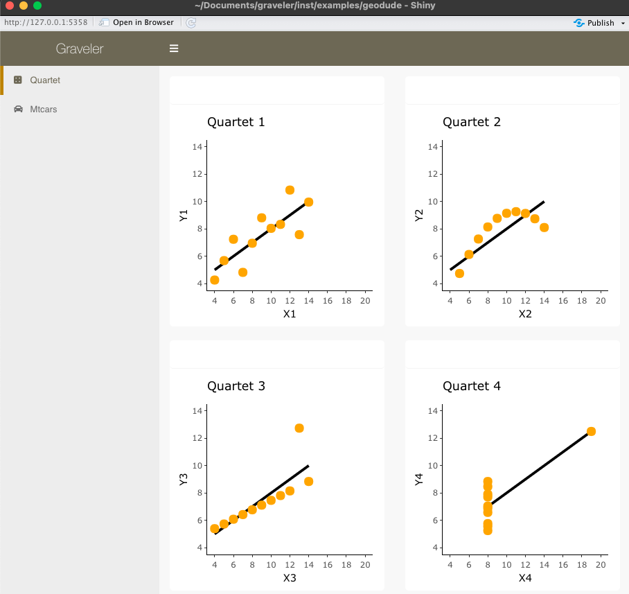
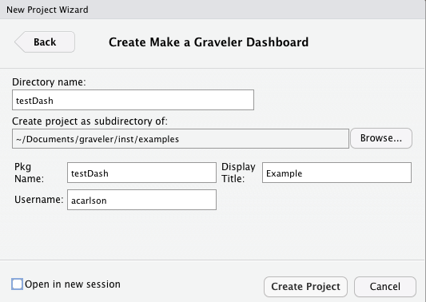
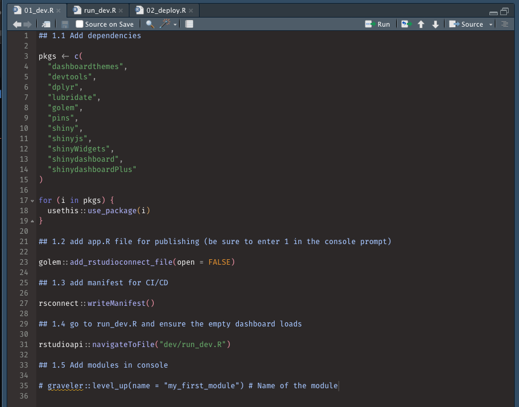
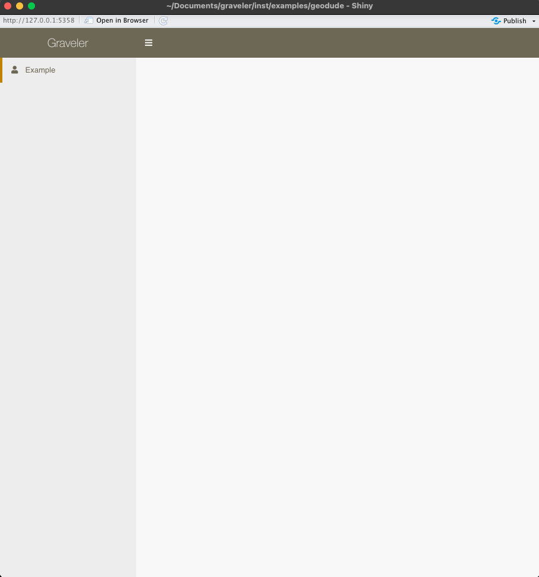
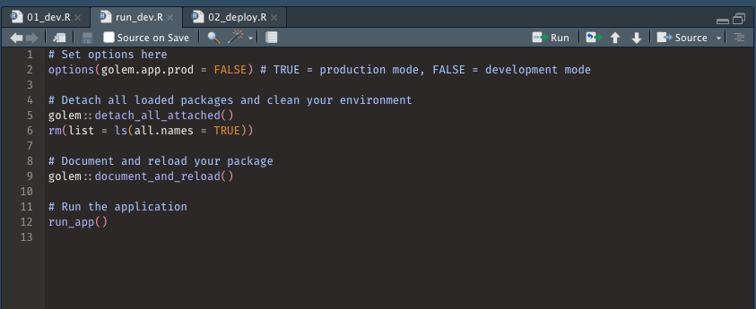
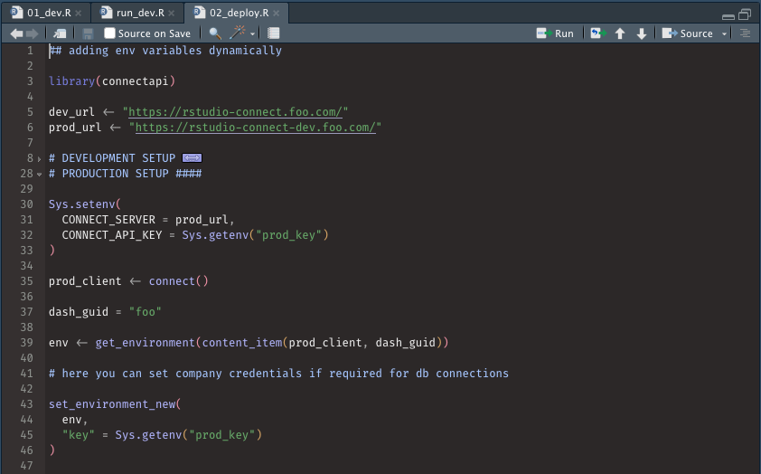
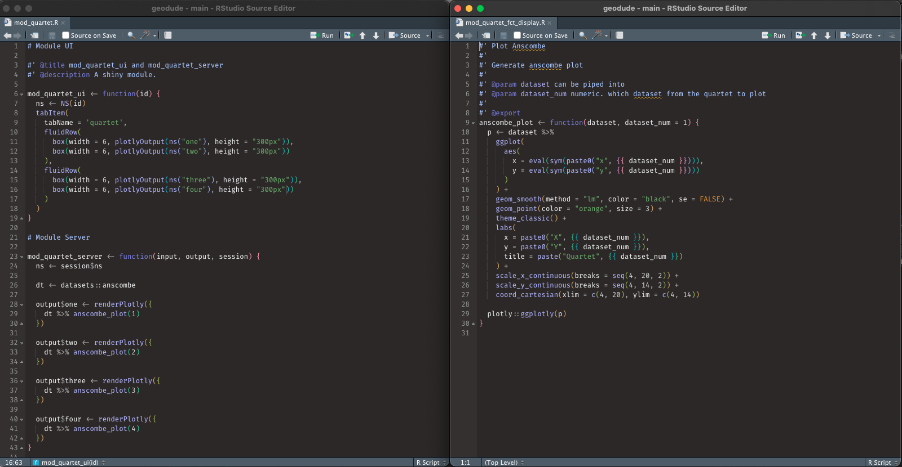
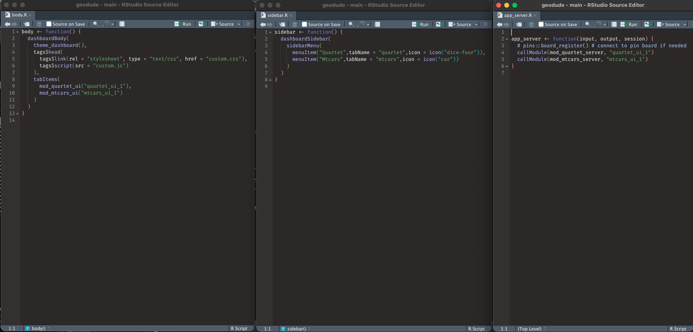

# graveler

> Build standardized, modular dashboards in {shiny}

## Overview

{graveler} is a wrapper for the [{golem}](https://engineering-shiny.org/) package built by several intelligent people over at ThinkR. At a high level, {golem} turns your shiny dashboards into a package framework and allows you to build and deploy them almost exactly as you would an R package. This allows for better documentation, testing, robustness, etc. It’s an amazing guide to engineering dashboards, but the concepts themselves can be complex and technical.

{graveler} abstracts away its technical side and set defaults for your development workflow (and sets up company branding while you are at it). You can make a working dashboard in less than a minute!

## Why Bother?

As any development team grows larger, it is important to standardize code to avoid the dreaded event in which you are handed a project that is coded so differently from your usual workflow that you either have to spend hours refactoring and / or rebuilding from scratch.

Additionally, {shiny} itself can be complicated to spin up at times for developers who are not familiar with its syntax. {graveler} allows you to create a standard, scalable {shiny} framework so you can focus on actual dashboard element creation instead of spending time getting the various backend pieces to talk to each other.

> Note that this package is not like {shinyWidgets} or other shiny element packages. This is a dashboard skeleton creator that allows you and your team to all start from the same page (some might say fluidPage) so your dashboards all have the same feel, layout, and backend creation.

## Installation

You can install the package via devtools:

```{r}
devtools::install_github("ghcarlalan/graveler")
```

And you can see a small example of a dashboard with:

```{r}
graveler::geodude_example()
```

The file structure for geodude is located in the examples/ folder.



## Creation

To create a {graveler} dashboard:

1.  Click `New Project`

2.  Select `New Directory`

3.  Select `Make a Graveler Dashboard`

4.  Fill out the form, ensuring that the `Directory Name` and `Pkg Name` both match and are written in camelCase (failing to do so will break your dashboard immediately)

5.  Make sure to set the proper subdirectory

6.  Click `Create Project`



This will make a new directory on your machine with the following structure:

```{r}
  "
  $./dashboard/
   .
   ├── .Rbuildignore # ignores systems files not needed for builds
   ├── DESCRIPTION # where libraries are installed for your package
   ├── dev/
   │   ├── 01_dev.R # package dependencies and system file creations
   │   ├── run_dev.R # build, document, and run the shiny dashboard
   │   └── 02_deploy.R # rstudio connect integration functions
   ├── foo.Rproj
   ├── inst/
   │   └── app/
   │       ├── www/ # standard shiny extra file subfolder
   │       |   ├── favicon.ico # golem favicon
   │       |   └── graveler_sprite.svg # icon in upper left of collapsed header
   |       └── runners/ # scheduled reports and pin integration
   │           └── example_runner.Rmd
   ├── man/ # .Rd system files for functions generated by R
   └── R/
       ├── apex_libraries.R # necessary libraries your dashboard loads
       ├── app_server.R # callModules here
       ├── app_ui.R # combines header, sidebar, body files
       ├── body.R # organizes UI layouts
       ├── golem_add_external_resources.R # allows usage of www/ folder
       ├── header.R # display name and other shinydashboardPlus features
       ├── sidebar.R # tabs and their icons
       └── theme.R # system file to format dashboards with branding
  "
```

## Initialization

When you load up the new project, you will have three files open: `01_dev.R`, `run_dev`, and `02_dev.R`.

### 01_dev

The first file sets up the dependencies for deployment. If you check the `DESCRIPTION` file, it will have no imports on initialization. When you run this file, it attaches all of your libraries to the package so that the server you publish to can know what to install and run.

These include the libraries you need to run your dashboard, a golem.config system file, an app.R file to deploy on RStudio Connect, and a manifest file to use git backed content within RStudio Connect. You can adjust these to fit your workflow.

> **Note:** When you run the line `golem::add_rstudioconnect_file(open = FALSE)`, you will be prompted in your console to create a golem-config.yml file. Enter 1 when prompted to create the necessary backend files required for {golem} to run your dashboard package.

At the end of the file, you will navigate to the run_dev.R file.



### run_dev

Once your dependencies and system files are in place, you can run all code in the `run_dev.R` file. This should successfully run and load your (currently empty) shiny dashboard! In the span of a minute you have already made a reproducible and fully functional framework!



If you are familiar with building R packages, this file is the equivalent of running the `Install and Restart` option: it creates your `NAMESPACE`, documents .Rd files, and temporarily installs it locally.

> If you need to add a new library, simply add into the `01_dev.R` file (and the `apex_libraries.R` file) and run it again. If you need to remove a library, you will need to edit the `DESCRIPTION` file manually.



### 02_deploy

This wrapper was built with RStudio Connect integration as the main method of publishing. As such, you might not need this file specifically, as all it does by default is allow you to programmatically set environment variables for Rstudio API keys so dashboards can connect to pinned datasets. I suppose the filename is a misnomer since it does not actually deploy code to rsconnect (that comes later), but you can easily convert this to suit your needs for publishing.



## Customization

Editing {graveler} options is easy as well. Obviously, you can edit colors, naming conventions, etc after the project is created, but if you want to apply standards for everyone, I would recommend forking this repository and creating your own internal version of the package that your developers actually install.

All the custom file parameters can be found in {graveler}'s inst/extdata folder (when you create a {gaveler} project it simply copies everything in this folder}. Colors would be edited in the R/theme.R file and default or custom libraries would be edited in the dev/01_dev.R and R/apex_libraries.R files as examples.

## Modularization

If you are unfamiliar, modularization splits your dashboard into *n* files where *n* is the number of sidebar tabs / modules you want to make that each have their own UI and server namespaces. This allows you to independently load each module's code (if one breaks, the rest will still work) and reuse IDs for UI elements (you can give different plotOuputs a generic name like "chart" across two different modules).

### Creation

When inside a `{graveler}` project, running the function `level_up(name = "foo")` will add a module to your dashboard as well as a "fct" file, which is how {golem} [suggests you functionalize your code](https://engineering-shiny.org/build-app-golem.html?q=fct#submodules-and-utility-functions):

```{r}
  "
  $./dashboard/
   .
   ├── R/
   │   ├── 1 libraries.R
   │   ├── app_config.R
   │   ├── app_server.R
   │   ├── app_ui.R
   │   ├── body.R
   │   ├── golem_add_external_resources.R
   │   ├── header.R
   │   ├── mod_foo.R                    <<<<< HERE
   │   ├── mod_foo_fct_display.R        <<<<< HERE
   │   ├── run_app.R
   │   ├── sidebar.R
   │   └── snap_dashboard.R
   ├── man/
   ├── inst/
   ├── dev/
   ├── DESCRIPTION
   ├── foo.Rproj
   ├── .Rbuildignore
   └── NAMESPACE
  "
```


You place your UI and server code in the `mod` file, and then you abstract away repeatable data manipulation or plotting functions inside the `fct` file. You can see this in the `geodude` example dashboard files:



In general, this helps keep your module code short and tidy, and allows you to put documentation for your functions just like a package.

### Connection

`level_up` might create your module, but you still need to tell your dashboard to include and run this module. To do so, there are three lines at the bottom you copy and paste into their appropriate files: body.R, app_server.R, and sidebar.R (uncommentted, of course).

The body and sidebar lines need to be separated with commas if you have multiple modules, but the app_server will be individual lines like so:



Once that is done, your modules should appear on the left. All that is left to do is to insert your actual dashboard elements.

## Deployment

Here are some examples of RStudio integration publishing. This assumes you have your server set up and your Rstudio Connect account linked to your RStudio IDE.

### Publish via Button

Once the run_dev.R file runs and your dashboard is error free, you can simply click the blue, publish button in the top right. It will gather your dependencies, ensure the server has them installed, and then your dashboard will be viewable on RStudio Connect.

### Publish via Github

While more involved then simply clicking a button, git backed content will ensure your published works will align with your team's codebase and allow others to collaborate easier. Earlier, we made a manifest.json file at the end of the 01_dev.R file. This creates an "image" that RStudio looks for and reproduces from github directly.

To publish for the first time, you push your code to whichever repo and branch on github, then in RStudio Connect you click its blue, publish button. You then navigate to the repo and branch you just pushed to, find the manifest file. Just like before, it will gather your dependencies from the manifest, ensure the server has them installed, and then your dashboard will be viewable on RStudio Connect.

To republish changes in the future, you simply merge your code to github and the file will automatically reflect those changes when it sees them.
